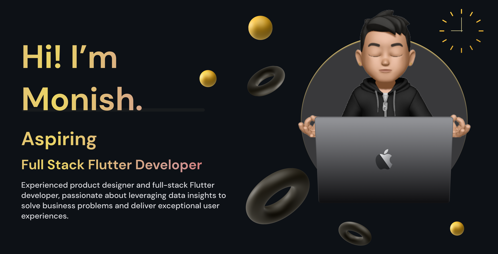

<h1 align="left">Hi there, I'm Monish Coumar! 👋</h1>

###

<h4 align="left">I'm a UX Designer and Full Stack Developer with a passion for creating seamless user experiences and efficient code. My toolkit includes Figma for design, Flutter for app development, Node.js for backend development, MongoDB for database management, and Postman for API testing.</h4>

###

<h2 align="left">About me</h2>

###

🌱 I’m currently learning Flutter, Node.js, Express, Postman, MongoDB, Java Programming 📫 How to reach me - myselfmonish08@gmail.com 👨‍💻 All of my projects are available at - myselfmonish.framer.website 📄 Know about my experiences - https://tinyurl.com/bdm9kb3y

###

<h2 align="left">I code with</h2>

###

  
  
  
  
  
  
  
  
  
  
  
  
  
  
  
  
  
  
  
  
  
  
  
  
  
  
  
  
  

###

<h2 align="left">Connect with me!</h2>

###

  
  

